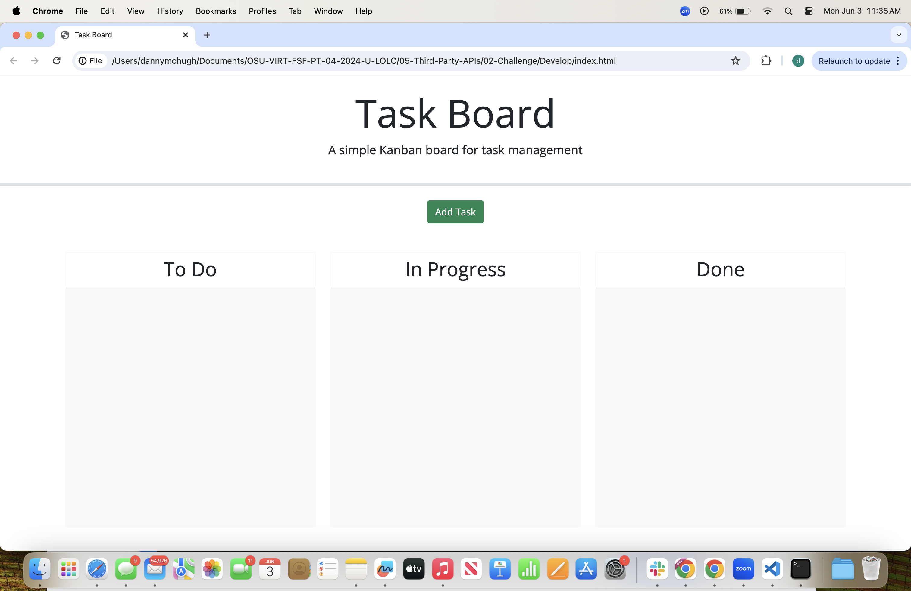

# <My-Tasks>

## Description

My motivation to build this project was to keep tasks organized. Red is for overdue, yellow is upcoming & white is more time to do.
I built this to help create a place to organize tasks.
This problem solved an issue where someone may have that they don’t have a planner or notebook to write their tasks.
I learned how to make different colors for time amount for the tasks.

## Table of Contents 

If your README is long, add a table of contents to make it easy for users to find what they need.

- [Installation](#installation)
- [Usage](#usage)
- [Credits](#credits)
- [License](#license)

## Installation

No need to install. The page is accessible to use on any browser.

## Usage

On the page, you are able to create and delete tasks. Red is for overdue tasks, yellow is upcoming, and white is normal time.
```md

(https://github.com/dannymcq2/module5tasks/blob/main/assets/img/screenshot-tasks.png)
```

   


## Credits

N/A

## License

MIT License

Copyright (c) 2024 dannymcq2

Permission is hereby granted, free of charge, to any person obtaining a copy
of this software and associated documentation files (the "Software"), to deal
in the Software without restriction, including without limitation the rights
to use, copy, modify, merge, publish, distribute, sublicense, and/or sell
copies of the Software, and to permit persons to whom the Software is
furnished to do so, subject to the following conditions:

The above copyright notice and this permission notice shall be included in all
copies or substantial portions of the Software.

THE SOFTWARE IS PROVIDED "AS IS", WITHOUT WARRANTY OF ANY KIND, EXPRESS OR
IMPLIED, INCLUDING BUT NOT LIMITED TO THE WARRANTIES OF MERCHANTABILITY,
FITNESS FOR A PARTICULAR PURPOSE AND NONINFRINGEMENT. IN NO EVENT SHALL THE
AUTHORS OR COPYRIGHT HOLDERS BE LIABLE FOR ANY CLAIM, DAMAGES OR OTHER
LIABILITY, WHETHER IN AN ACTION OF CONTRACT, TORT OR OTHERWISE, ARISING FROM,
OUT OF OR IN CONNECTION WITH THE SOFTWARE OR THE USE OR OTHER DEALINGS IN THE
SOFTWARE.

---

🏆 The previous sections are the bare minimum, and your project will ultimately determine the content of this document. You might also want to consider adding the following sections.

## Badges

https://github.com/dannymcq2/module5tasks

## Features

Task list. Able to create & delete.

## How to Contribute

[![Contributor Covenant](https://img.shields.io/badge/Contributor%
## Tests


